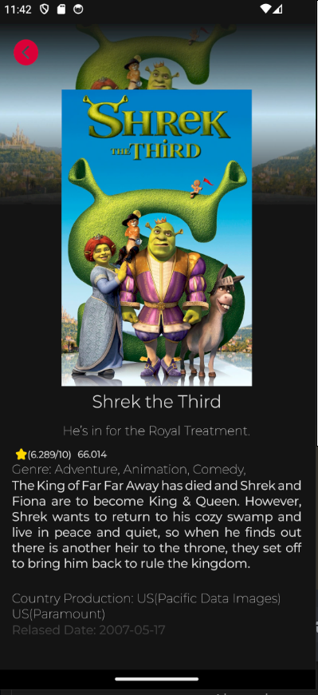

# Aplikacja mobilna o tematyce filmowej

Aplikacja mobilna umożliwia użytkownikom przeglądanie bazy filmów, dodawanie recenzji oraz ocenianie filmów. Użytkownicy mogą także eksplorować filmy w podziale na różne kategorie (np. gatunki, nowości, popularne). Projekt skupia się na zapewnieniu intuicyjnego interfejsu i funkcjonalności sprzyjających społeczności kinomanów.

This is a new [**React Native**](https://reactnative.dev) project, bootstrapped using [`@react-native-community/cli`](https://github.com/react-native-community/cli).

# Wymagania niefunkcjonalne

- Płynne działanie na Androidzie i iOS.
- Responsywny i estetyczny interfejs użytkownika.
- Wydajne zapytania do bazy danych.
- Bezpieczne przetwarzanie danych użytkowników.

# Wymagania funkcjonalne

- Rejestracja i logowanie.
- Lista filmów z filtrowaniem i wyszukiwaniem.
- Szczegóły filmu (opis, reżyser, ocena).
- Dodawanie recenzji i ocen.
- Kategorie filmów (gatunki, popularne, nowości).
- Historia oglądanych filmów.

# Potencjalne ryzyka

- Brak doświadczenia w bazach danych C#.
- Ograniczona znajomość React Native.
- Trudności z integracją z API (np. TMDb, IMDb).
- Problemy z optymalizacją na starszych urządzeniach.

# Getting Started

> **Note**: Make sure you have completed the [React Native - Environment Setup](https://reactnative.dev/docs/environment-setup) instructions till "Creating a new application" step, before proceeding.

## Quick Start

### Step 1: Install Dependencies

W katalogu głównym projektu, zainstaluj wszystkie zależności:

```bash
npm install
```

### Step 2: Run on Local Android Emulator

Uruchom aplikację na emulatorze Androida:

```bash
npx react-native run-android
```

### Preview

Poniżej znajdziesz podgląd aplikacji po uruchomieniu:




## Step 3: Modifying your App

Now that you have successfully run the app, let's modify it.

1. Open `App.tsx` in your text editor of choice and edit some lines.
2. For **Android**: Press the <kbd>R</kbd> key twice or select **"Reload"** from the **Developer Menu** (<kbd>Ctrl</kbd> + <kbd>M</kbd> (on Window and Linux) or <kbd>Cmd ⌘</kbd> + <kbd>M</kbd> (on macOS)) to see your changes!

   For **iOS**: Hit <kbd>Cmd ⌘</kbd> + <kbd>R</kbd> in your iOS Simulator to reload the app and see your changes!

## Congratulations! :tada:

You've successfully run and modified your React Native App. :partying_face:

### Now what?

- If you want to add this new React Native code to an existing application, check out the [Integration guide](https://reactnative.dev/docs/integration-with-existing-apps).
- If you're curious to learn more about React Native, check out the [Introduction to React Native](https://reactnative.dev/docs/getting-started).

# Troubleshooting

If you can't get this to work, see the [Troubleshooting](https://reactnative.dev/docs/troubleshooting) page.

# Learn More

To learn more about React Native, take a look at the following resources:

- [React Native Website](https://reactnative.dev) - learn more about React Native.
- [Getting Started](https://reactnative.dev/docs/environment-setup) - an **overview** of React Native and how setup your environment.
- [Learn the Basics](https://reactnative.dev/docs/getting-started) - a **guided tour** of the React Native **basics**.
- [Blog](https://reactnative.dev/blog) - read the latest official React Native **Blog** posts.
- [`@facebook/react-native`](https://github.com/facebook/react-native) - the Open Source; GitHub **repository** for React Native.
